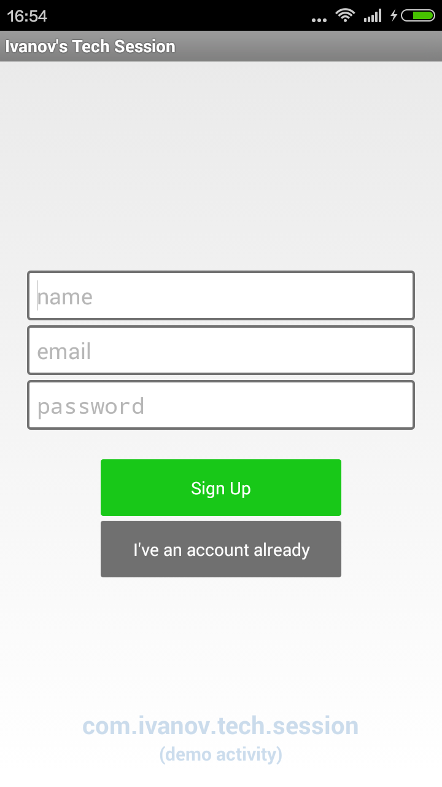
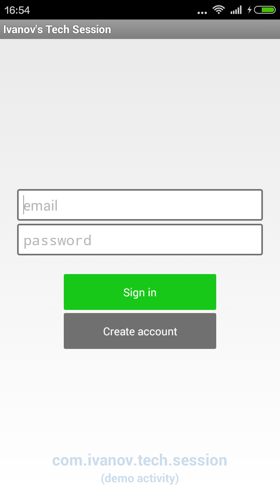
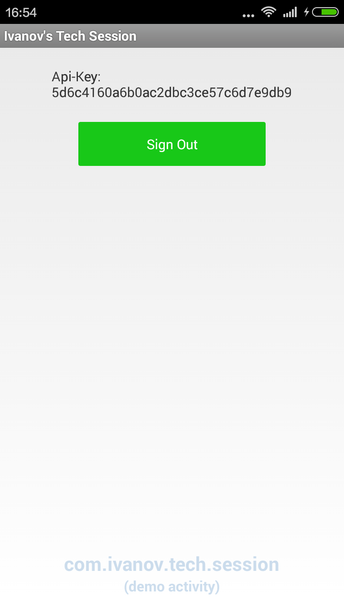

Session
=======

Библиотека которая берет на себя ответственность за регистрацию аккаунта, логина и всех операций связанных с авторизацией. Самостоятельно создает и показывает нужные фрагменты. Реализует удобный интерфейс обратного вызова. Управляет сценарием ошибки сети. Требует очень мало кода


Пример использования
--------------------

```java
import com.actionbarsherlock.app.SherlockFragmentActivity;
import com.ivanov.tech.connection.Connection;
import com.ivanov.tech.session.Session;
```

```java
...
    	//Init before call checkApiKey. It just init App Preferences, where are stored api-key and user_id
      Session.Initialize(getApplicationContext());
...        
    	Session.checkApiKey(getActivity(), getSupportFragmentManager(), R.id.main_container, new Connection.ProtocolListener() {
			
			@Override
			public void onCanceled() {
				//Приложение не запустится, пока пользователь не будет авторизован
				finish();
			}
			
			@Override
			public void isCompleted() {
				FragmentManager fragmentManager = getSupportFragmentManager();
		        fragmentManager.beginTransaction()
		                .replace(R.id.main_container, new FragmentDemo())
		                .commit();		
			}
		});
...	
```
**Аргументы:**
* `getActivity` - контекст активити
* `getFragmentManager` - `supportFragmentManager` из actionbarsherlock (Внимание! Не путайте с нативным getFragmentManager)
* `R.id.main_container` - передается layout используемый в качестве окна активити, тогда диалог будет показан на весь экран. Если передать другой layout, то в качестве окна диалога будет использован переданный вами layout
* ```java new ProtocolListener``` - реализация интерфэйса `ProtocolListener` для обратного вызова. Тут передается операция (другими словами ваш код)

**Описание**

При вызове `checkApiKey`, программа проверяет: существует ли api-key, если существует отправляет его на сервер. Если сервер решит, что api-key актуальный, то программа вызывает метод `isCompleted` переданного `ProtocolListener` объекта; 
Иначе создается и открывается фрагмент `FragmentRegister`, чтобы создать новый аккаунт и получить api-key:



Если у вас уже существует аккаунт, то можете просто выполнить логин. Для этого кликните кнопку "I've an account already", тогда откроется фрагмент `FragmentLogin`:



Как только используя фрагменты `FragmentLogin` и `FragmentRegister` в конце-концов получите apikey, будет вызван метод `isCompleted`.

**ВАЖНО!** Нужно обязательно сделать инициализацию, вызвав `Session.Initialize(getApplicationContext())` в `onCreate` методе `Activity`. В качестве параметра передается `ApplicationContext`

Вызов `checkApiKey` как правило нужно делать при старте приложения. Автор рекомендует делать это внутри `onCreate` первого запустившегося активити, как показано в DemoActivity.java. Таким образом пользователь войдет в приложение, только если пройдет авторизацию (обратите внимание на `finish()` внутри `onCanceled` переданного `ProtocolListener` объекта)

Api-Key
----------------
Программа отправляет на сервер пароль и логин, в ответ получает sha1 ключ (`apikey`). Полученный ключ используется вместо логина и пароля, во всех следующих сессиях 

При повторном отправлении логина и пароля(даже если будет отправлен из другого устройства), имеющийся sha1 ключ становится неактуальным. На сервере создается один `apikey` на один аккаунт. Использовать один и тот же аккаунт в двух разных устройствах одновременно - не получится

Концепцию Api-Key хорошо объясняет Ravi Tamada в своем [уроке][7]

Серверная часть
---------------
**ВНИМАНИЕ!** Данная библиотека - это реализация клиентской части системы авторизации пользователя. Это только клиентская часть приложения, для того чтобы она работала требуется серверная часть.

Серверную часть вы можете видеть в репозитории автора на [GitHub][4]. Есть инструкция по самостоятельному запуску и настройке сервера

Используемые библиотеки
-----------------------

* [ActionBarSherlock][1]
* [Volley][2]
* [Connection][3]- библиотека автора. Используется как подмодуль

Добавление и запуск проекта в Eclipse
-------------------------------------

1. Для клонирования репозитория, автор рекомендует использовать командную строку, вместо EGit Eclipse. Т.к. проект содержит настройки workspace в папке репозитория. В командной строке выполните:
```
$ git clone git://github.com/Igorpi25/Session.git
$ git submodule init
$ git submodule update
```
2. В Eclipse выберите в качестве workspace рабочий каталог только-что клонированного репозитория. Eclipse автоматически найдет репозиторий внутри каталога
3. Добавьте режим "Git Perspective" в настройках Eclipse. Для этого, перейдите в меню `Window->Perspective->Open Prespective->Other`. В появившемся списке выберите `Git`, и нажмите ОК
4. В режиме "Git Perspective", найдите окно "Git Repositories". Кликните правой кнопкой мыши на ваш репозиторий, и нажмите `ImportProjects...`. Выберите `Import Existing eclipse project`, и нажмите "Далее". Поставьте галочку на проектах "Session", "Connection" и "ActionBarSherlock" и нажмите "Finish"
5. Перейдите в режим "Java Perspective", и удостоверьтесь что проекты импортированы правильно. "Connection" и "ActionBarSherlock" должны быть добавлены в проект "Session" в качестве модуля. Для работы проекта требуется **Android SDK, API Level 21**, зайдите в SDK Manager - скачайте и установите
6. В файле **Session.java** в "com.ivanov.tech.session" напишите правльный домен для `testApiKeyUrl`, `registerUrl`, `loginUrl`
7. Выполните Project->Clean
8. Убедитесь что серверная часть настроена правильно
8. Можно запускать



Использование в своем проекте:
------------------------------
* Выполните все из "Добавление и запуск проекта в Eclipse"
* Сделайте проект Session библиотекой
* Добавьте проект Session в качестве библиотеки в ваш проект
* В манифесте добавьте строки:
```xml	
	<uses-permission android:name="android.permission.ACCESS_WIFI_STATE" />
	<uses-permission android:name="android.permission.ACCESS_NETWORK_STATE" />
	<uses-permission android:name="android.permission.CHANGE_WIFI_STATE" />
	<uses-permission android:name="android.permission.INTERNET" />
```
* Добавьте `Session.Initialize(getApplicationContext())` в `onCreate`вашего Activity, как это сделано в `DemoActivity.java` в `com.ivanov.tech.session` 

Пример использования вы можете видеть в проекте [Profile][6]

[1]: http://actionbarsherlock.com/
[2]: https://github.com/mcxiaoke/android-volley
[3]: https://github.com/Igorpi25/Connection
[4]: https://github.com/Igorpi25/Server
[5]: https://git-scm.com/book/en/v2/Git-Tools-Submodules/
[6]: https://github.com/Igorpi25/Profile
[7]: http://www.androidhive.info/2014/01/how-to-create-rest-api-for-android-app-using-php-slim-and-mysql-day-12-2/
